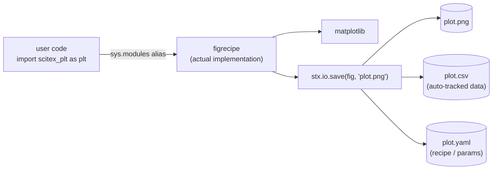
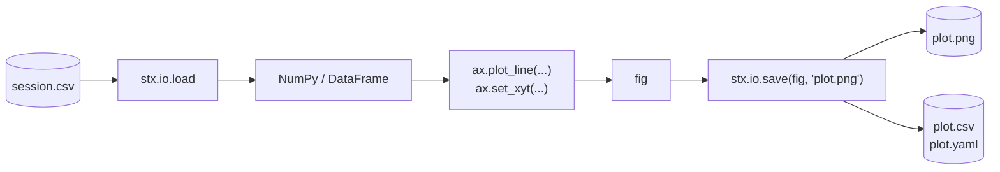

# SciTeX Plt (<code>scitex-plt</code>)

<p align="center">
  <a href="https://scitex.ai">
    
  </a>
</p>

<p align="center"><b>Publication-ready plotting with auto CSV export — sys.modules alias for figrecipe</b></p>

<p align="center">
  <a href="https://scitex-plt.readthedocs.io/">Full Documentation</a> · <code>uv pip install scitex-plt[all]</code>
</p>

<!-- scitex-badges:start -->
<p align="center">
  <a href="https://pypi.org/project/scitex-plt/"></a>
  <a href="https://pypi.org/project/scitex-plt/"></a>
  <a href="https://github.com/scitex-ai/scitex-plt/actions/workflows/rtd-sphinx-build-on-ubuntu-latest.yml"></a>
</p>
<p align="center">
  <a href="https://github.com/scitex-ai/scitex-plt/actions/workflows/pytest-matrix-on-ubuntu-py3-11-3-12-3-13.yml"></a>
  <a href="https://github.com/scitex-ai/scitex-plt/actions/workflows/import-smoke-on-ubuntu-py3-12.yml"></a>
  <a href="https://github.com/scitex-ai/scitex-plt/actions/workflows/newb.yml"></a>
  <a href="https://codecov.io/gh/scitex-ai/scitex-plt"></a>
</p>
<!-- scitex-badges:end -->

---

## Problem and Solution

| # | Problem | Solution |
|---|---------|----------|
| 1 | **Matplotlib boilerplate for publication figures** — manually setting DPI, fonts, axis labels, CSV sidecars, and mm-precision layout for every paper figure | **`stx.plt.subplots()`** — thin wrapper around figrecipe returning a tracked axes with `.plot_line(...)`, `set_xyt(...)`, and publication-ready defaults |
| 2 | **Figure and underlying data drift apart** — the PNG lives in the repo, the CSV that generated it sits in a notebook cell and eventually disappears | **Auto CSV export on save** — `stx.io.save(fig, "plot.png")` writes `plot.png` + `plot.csv` + `plot.yaml` atomically so the data is always reproducible |
| 3 | **No way for AI agents to generate figures** — coding agents need a structured API, not matplotlib's stateful pyplot | **MCP tools (`plt_line`, `plt_scatter`, `plt_stx_*`)** — agents compose publication plots from CSVs via column specs, no inline arrays needed |

## Installation

```bash
pip install scitex-plt
```

This installs `figrecipe` as a dependency. `scitex-plt` is a `sys.modules` alias:
`scitex_plt is figrecipe` evaluates to `True` after import.

## Architecture



## 4 Interfaces

`scitex-plt` exposes the same four-interface surface as the rest of the SciTeX
ecosystem (delegated to figrecipe):

<details open>
<summary><b>Python API</b> — <code>import scitex_plt as plt</code></summary>

```python
import scitex_plt as plt

fig, ax = plt.subplots()
ax.plot([1, 2, 3], [1, 4, 9])
plt.save(fig, "figure.png")  # writes figure.png + figure.csv
```

</details>

<details>
<summary><b>CLI</b> — <code>scitex-plt --help</code></summary>

```bash
scitex-plt --help
scitex-plt info
```

</details>

<details>
<summary><b>MCP tools</b> — <code>plt_*</code> namespace</summary>

AI agents call `plt_line`, `plt_scatter`, `plt_stx_*` etc. from CSV column specs.

</details>

<details>
<summary><b>Skills</b> — <code>figrecipe</code> skill loaded by agents at startup</summary>

Loaded automatically by SciTeX-aware agents.

</details>

## Demo



## Quick Start

```python
import scitex_plt as plt

fig, ax = plt.subplots()
ax.plot([1, 2, 3], [1, 4, 9])
plt.save(fig, "figure.png")  # writes figure.png + figure.csv
```

## Part of SciTeX

`scitex-plt` is part of [SciTeX](https://scitex.ai) — a Python framework for
reproducible scientific computing. It is the namespace alias for
[figrecipe](https://github.com/ywatanabe1989/figrecipe), used by sibling
packages such as `scitex-stats`, `scitex-io`, and `scitex-clew`.

Install via `pip install scitex[plt]`, then use `scitex.plt` from Python or `scitex plt` from the CLI.

```bash
pip install scitex[plt]   # pulls scitex-plt as part of the umbrella
```

```python
import scitex as stx
stx.plt.subplots()        # routed through scitex.plt → figrecipe
```

```bash
scitex plt --help         # umbrella subcommand
```

The SciTeX system follows the Four Freedoms for Research below, inspired by [the Free Software Definition](https://www.gnu.org/philosophy/free-sw.en.html):

>Four Freedoms for Research
>
>0. The freedom to **run** your research anywhere — your machine, your terms.
>1. The freedom to **study** how every step works — from raw data to final manuscript.
>2. The freedom to **redistribute** your workflows, not just your papers.
>3. The freedom to **modify** any module and share improvements with the community.
>
>AGPL-3.0 — because we believe research infrastructure deserves the same freedoms as the software it runs on.

---

<p align="center">
  <a href="https://scitex.ai" target="_blank"></a>
</p>

<!-- EOF -->
